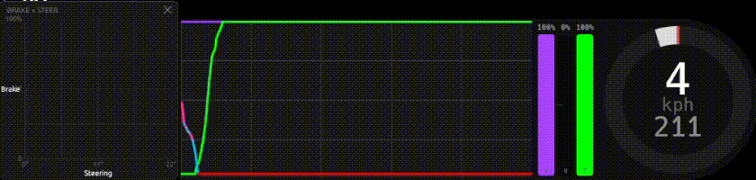

# SimTrace

A lightweight sim racing telemetry overlay. Displays pedal inputs, steering angle, gear, and speed in real time as a transparent overlay on top of your game.

## Demo
A demo of SimTrace in action showing the (toggleable) braking x steering phase plot on the left and brake/throttle traces on the right. 


## Features

- **Pedal trace graph** — scrolling throttle, brake, and clutch history
- **Pedal bars** — live clutch, brake, and throttle with ABS indication
- **Steering wheel** — visual angle indicator with gear and speed readout
- **Transparent overlay** — drag to position, drag the corner to resize
- **Configurable** — opacity, speed unit, colours, and trace window length
- **Trail braking help** — Useful utilities to help with trail braking
  - **Brake trace colouring** - Configurable colouring showing braking and ABS activation during cornering
  - **Braking x steering phase plot** - Live indicator to monitor corner entry/exit in real time

## Supported games

| Game                       | Notes                                    |
| -------------------------- | ---------------------------------------- |
| Assetto Corsa Competizione |                                          |
| Automobilista 2            | [Enable shared memory](#automobilista-2) |
| iRacing                    | Support is currently experimental        |

## Installation

Download the latest `.exe` from the [Releases](../../releases) page. No installer required — just run it.

## Usage

1. Start SimTrace before or after launching your game.
2. Select your game from the **⚙** config panel (top-right of the overlay).
3. Drag the title bar to reposition; drag the bottom-right corner to resize.
4. Click **Save** to persist your settings between sessions.

The overlay fades out when your cursor leaves it and reappears on hover.

## Automobilista 2

Enable shared memory: (from the main menu) `Options (top right) > System > Shared Memory` and setting it to `Project CARS 2`

## Building from source

Requires [Rust](https://rustup.rs/) (stable).

```sh
cargo build --release
```

The binary will be at `target/release/simtrace.exe` (Windows) or `target/release/simtrace` (other platforms).

## Settings

Settings are saved to:

- **Windows:** `%APPDATA%\simtrace\settings.toml`
- **macOS:** `~/Library/Application Support/simtrace/settings.toml`
- **Linux:** `~/.config/simtrace/settings.toml`
